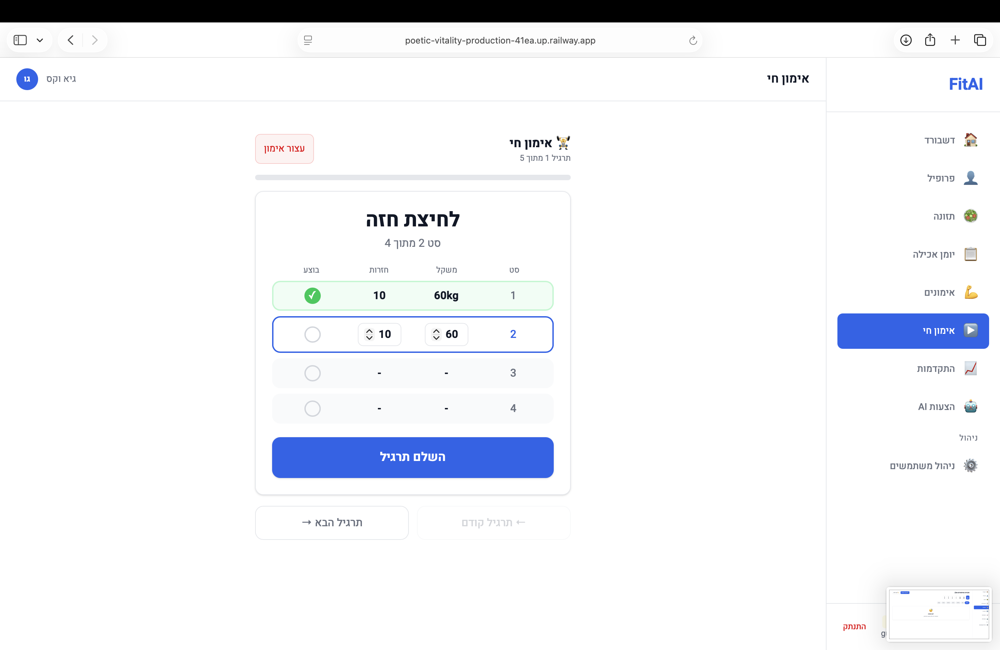
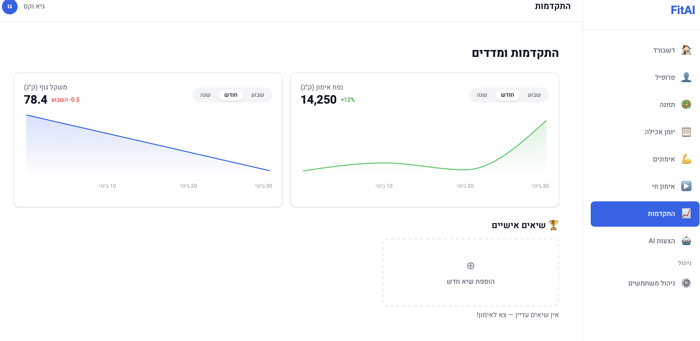
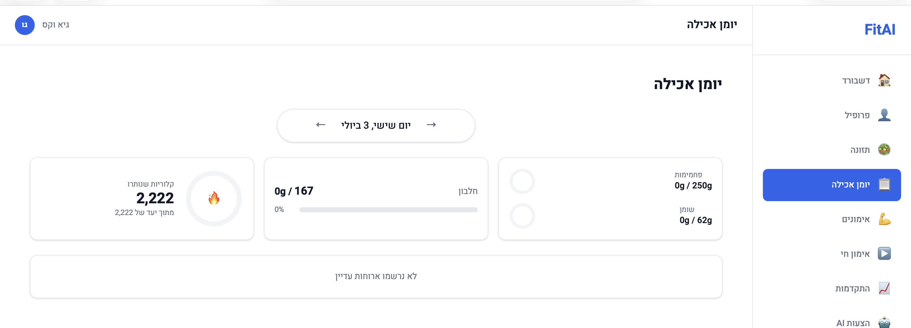
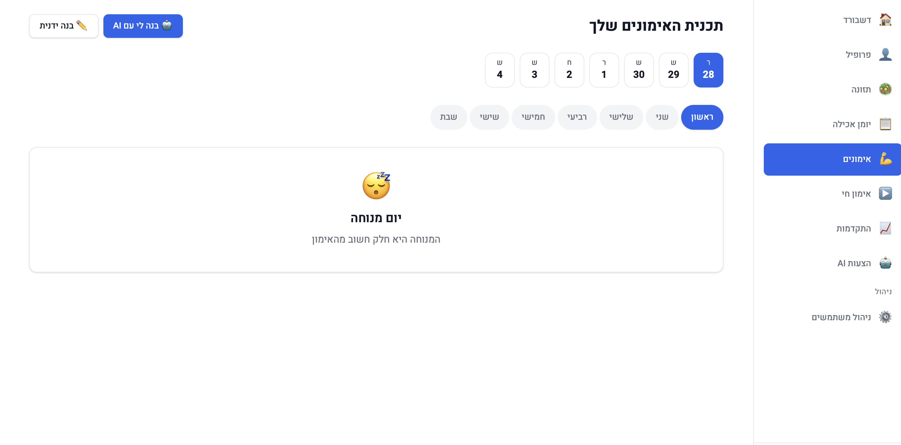
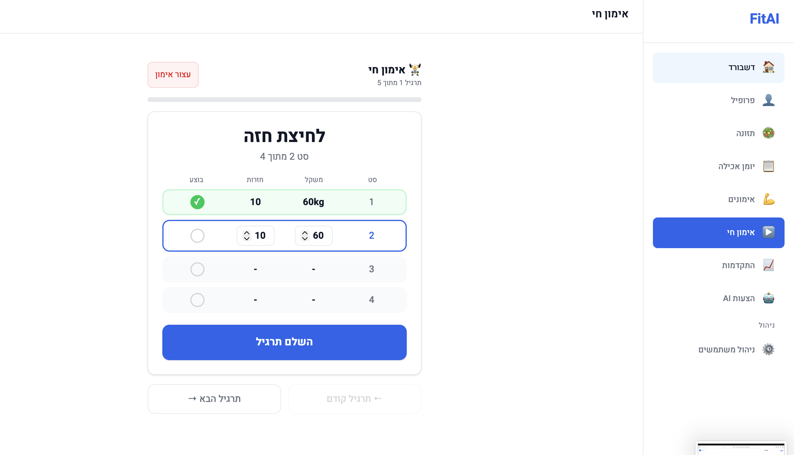

# FitAI 🏋️‍♂️🥗

AI-powered health, nutrition, and fitness web app with a Hebrew-language (RTL) interface. Built as a capstone project for an AI development certificate program.

**Live app:** [poetic-vitality-production-41ea.up.railway.app](https://poetic-vitality-production-41ea.up.railway.app)
**API:** [fitai-production-ce99.up.railway.app](https://fitai-production-ce99.up.railway.app)

---

## Screenshots

| Dashboard | Nutrition |
|---|---|
|  |  |

| Live Workout | Progress |
|---|---|
|  |  |

| Profile & Metrics |
|---|
|  |

---

## Overview

FitAI generates personalized weekly nutrition and workout plans using a multi-agent AI system, then lets users track daily meals, log workouts, and monitor progress over time — all through a clean, RTL-native Hebrew interface.

## Key Features

- 🤖 **Multi-agent AI planning** — three CrewAI agents (nutritionist, fitness coach, health supervisor) collaborate to generate a weekly plan, with a human approval step before it's applied
- 🍽️ **Nutrition tracking** — daily meal logging against a Hebrew food database, with macro breakdown (protein/carbs/fat) and calorie targets calculated from BMR/TDEE
- 💪 **Workout plans** — AI-generated or manually built weekly routines, with a live workout mode for logging sets, reps, and weight in real time
- 📊 **Progress tracking** — weight trend, training volume, and personal records over time
- 🔐 **Auth & admin** — JWT-based authentication with an admin panel for user management
- 📈 **Personalized metrics** — automatic BMI/BMR/TDEE and macro-target calculation based on user profile (age, weight, goal, activity level)

## Tech Stack

**Frontend**
- React + Vite
- RTL-first Hebrew UI

**Backend**
- FastAPI
- SQLAlchemy + PostgreSQL
- CrewAI (multi-agent orchestration) with Claude (Anthropic) as the underlying LLM
- JWT authentication

**Infrastructure**
- Deployed on Railway (separate staging and production environments)
- pytest test suite (SQLite in-memory for fast, isolated runs)

## Architecture Notes

- Three CrewAI agents run sequentially or in combination (`run_nutrition_crew`, `run_workout_crew`, `run_full_crew`), each with a distinct role, merging into a single weekly plan for user approval.
- Nutrition targets are derived from calculated BMR/TDEE rather than static defaults, adjusting to the user's stated goal (cut / maintain / bulk).
- Frontend and backend are deployed as separate Railway services, talking over a REST API.

## Local Development

```bash
# Backend
cd backend
cp .env.example .env
pip install -r requirements.txt
uvicorn app.main:app --reload

# Frontend
cd frontend
npm install
npm run dev
```

Required environment variables (see `.env.example`):
- `DATABASE_URL` — PostgreSQL connection string
- `SECRET_KEY` — JWT signing secret
- `ANTHROPIC_API_KEY` — used by the CrewAI agents
- `ALGORITHM`, `ACCESS_TOKEN_EXPIRE_MINUTES`, `ENVIRONMENT`

## Testing

```bash
cd backend
pytest
```

## Status

Actively developed. Current focus areas include a manual workout plan builder, a redesigned live workout screen, and upcoming visual AI features (meal photo analysis, voice logging, and body-photo progress tracking).

## License

MIT — see [LICENSE](./LICENSE).
